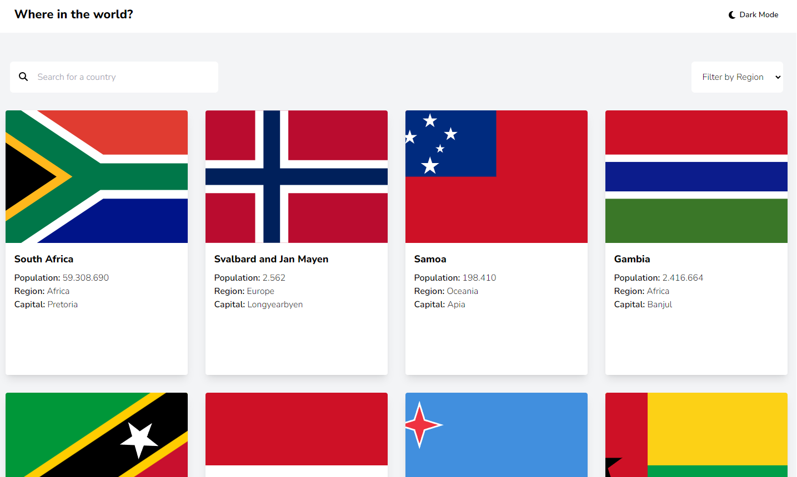
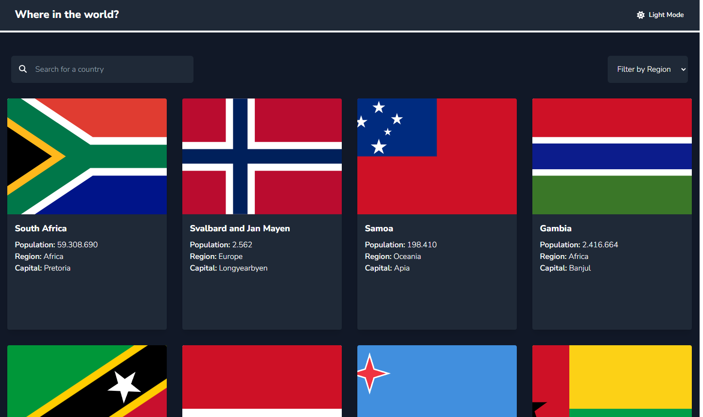

# Frontend Mentor - Solução do Rest Countries API

Essa é uma solução para o desafio Rest Countries API do Frontend MentorIO.

Projeto publicado: https://rest-countries-api-seven-tau.vercel.app/

## Sumário

- [Visão Geral](#visão-geral)
- [Foto](#foto)
- [Construção](#construído-com)
- [Autor](#autor)

## Visão Geral

Essa é uma solução para listar todos os países consumindo os dados de uma API, foi utilizado o VueJS (Typescript) com tailwind para montagem do front e utilização dos dados, e o axios para realizar a requisição com a API.

### Foto

Essas são fotos de como ficou o desafio:

### Construído com

- VueJS
- Tailwind
- Typescript
- Flexbox
- Grid

## Autor

- Frontend Mentor - [@haltshow](https://www.frontendmentor.io/profile/haltshow)
- GitHub - [@haltshow](https://github.com/haltshow)
- GitLab - [@gabrielabreualves](https://gitlab.com/gabrielabreualves)
